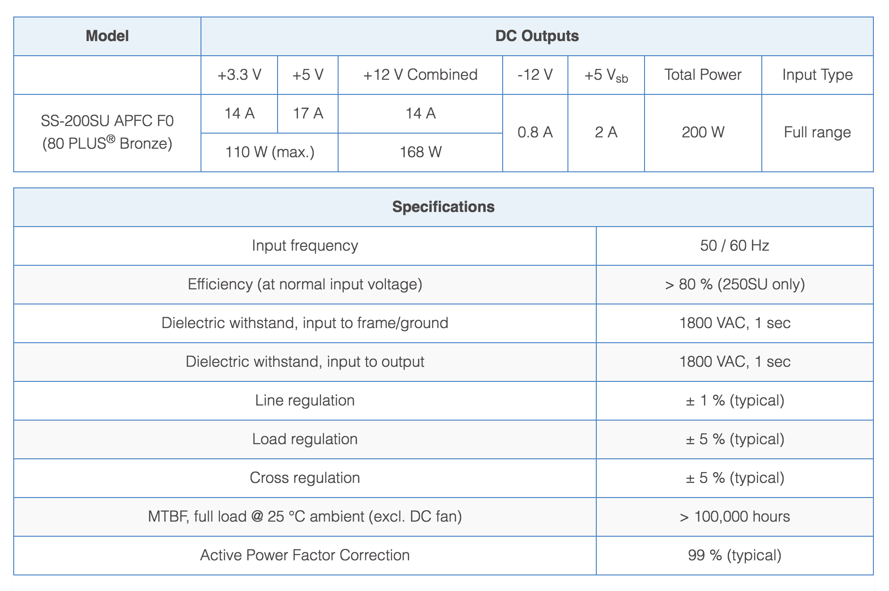
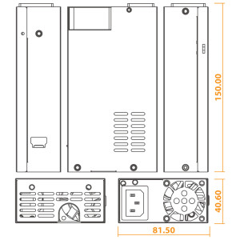
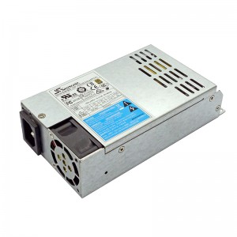
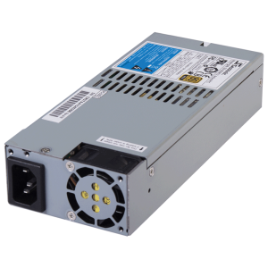
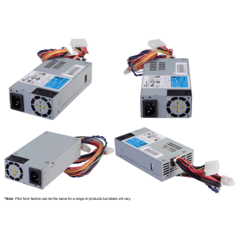
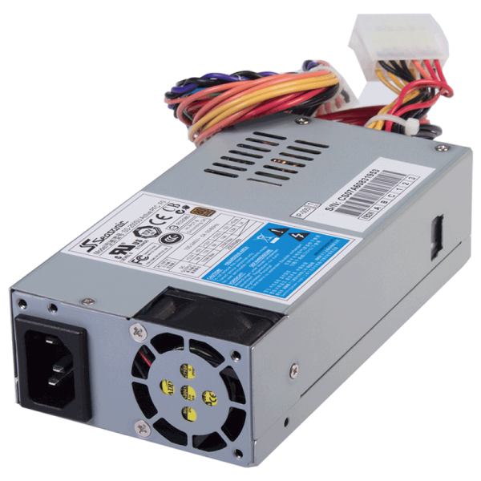
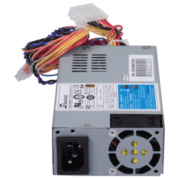
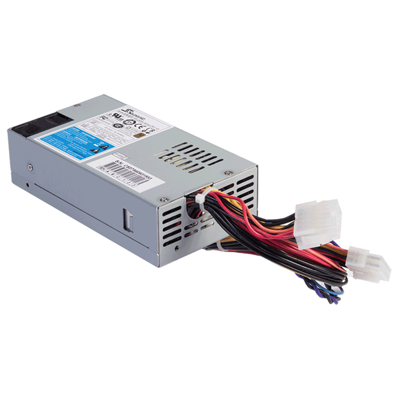
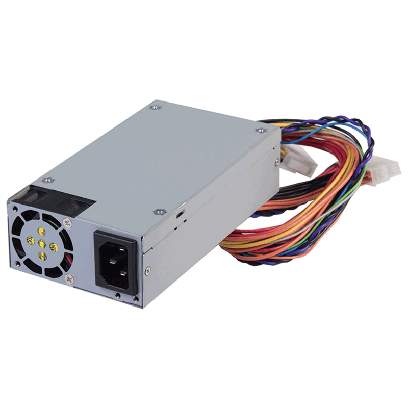

# SS- 200 SU Active PFC F0
http://www2.seasonic.com/product/ss-200-su-active-pfc-f0/

The Seasonic industrial level switch mode power supplies offer a reliable source for a wide range of setups. Our Flex ATX range with its full range AC input comes in 250 W and 200 W versions and is the ideal choice for workstations, standard or advanced servers and various automation or communication applications. These units comply with the latest PFC harmonics and are protected against short circuit, over voltage and over power. Their super low nose fan control makes them a pleasant companion in any industrial system.

## Features
* Flex ATX v1.0 compliant
* Forward converter circuit
* High efficiency and reliability
* Zero minimum load on 3.3 V rail
* 40 mm double ball bearing fan
* Super low noise fan control
* Short circuit protection on all outputs
* Over voltage protection
* Over power protection
* 100 % HiPot test
* 100 % Burn-in, high temperature cycled on/off
* PFC harmonics compliance: EN61000-3-2: 2006 + A1: 2007 + A2: 2009

## Specifications

## Drawings

## Downloads

http://seasonic.com/main/wp-content/uploads/2015/06/SS-250-200SU.pdf

## Gallery

